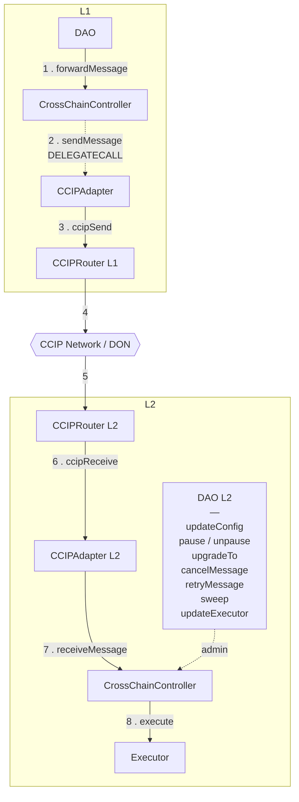

### Architecture

The architecture is deliberately flexible: adapters are swappable, because the
`CrossChainController` is the single entry point for both sending and receiving messages,
and it is where all configuration lives. Adapters hold no routing state of their own —
swapping in a new bridge means deploying an adapter and updating the controller's config,
not touching the controller itself.

Routing works off a per-destination config. When the controller is asked to forward a
message, it is given a `destinationId`; the config stored under that id holds two
addresses:

- `localAdapter` — the adapter on this chain that the controller hands the message to.
- `remoteAdapter` — the address on the destination chain that the message is addressed
  to.

On the destination chain, the arriving message is delivered to that remote adapter, which
in turn forwards it to the `CrossChainController` there. The controller is therefore both
ends of every route: the sender's entry point and the receiver's final destination.

### Permissions

Only one adapter is configured per destination chain id at any given time, so that single
bridge is a single point of failure. This demands care when assigning permissions.

**The threat.** Normally L1 governance is what updates the L2 controller's configuration,
and those updates travel over the bridge. If the bridge is compromised - say the L2
`CCIPRouter` - the attacker can inject an arbitrary message and shape it so the L2
`CrossChainController` believes it originated from legitimate L1 governance. The
controller cannot tell the difference: it trusts the bridge to have authenticated the
sender. An attacker with that capability could, for example, rewrite sensitive
configuration on the L2 controller.

**What makes it exploitable.** The controller routes every inbound payload to its
configured `Executor` for final execution. So whatever permissions that executor holds are
effectively reachable by anyone who controls the bridge. If the executor can call the
controller's own sensitive functions, a compromised bridge inherits that power.

This is precisely why the executor is kept separate from the L2 DAO. Pointing the
controller's `executor` at the L2 DAO and granting that DAO sensitive permissions on the
controller reproduces the same exposure — the identity of the executor is irrelevant, only
its permissions matter.

**Recommended configuration.** Set the controller's `executor` to a dedicated
`Executor`, and grant that executor **no permissions on the `CrossChainController`
itself**. Sensitive configuration is then changed only by the L2 DAO acting directly, off
the cross-chain path - so a compromised bridge cannot reach it.

**The alternative.** If you consider bridge compromise a negligible risk and would rather
not run a DAO and separate governance on L2, you can grant `Executor` those
sensitive permissions on the `CrossChainController`. The architecture fully supports this;
it trades the isolation above for a simpler L2 deployment. Alternatively, if you don't want to have `Executor` at all, you can set `executor` as the DAO L2 (in case you prefer to have DAO L2, but no `executor`). 

> These options are not mutually exclusive: the L2 controller's sensitive functions can be
> made callable by both the `Executor` (over the cross-chain path) and the L2 DAO. That
> keeps L1 governance in control by default while leaving the L2 DAO able to act
> immediately when speed matters — at the cost of accepting the bridge-compromise exposure
> described above.

### The Diagram

### Functions

#### `CrossChainController`

The message paths (`forwardMessage`, `receiveMessage`, `retryMessage`, `cancelMessage`)
are all `whenNotPaused`. The admin paths deliberately are not, so an incident can be
recovered from while the system is paused.

| Function | Access | What it does |
|---|---|---|
| `forwardMessage(dstChainId, gasLimit, message)` | `FORWARD_MESSAGE_PERMISSION` | Outbound entry point. Builds a `Transaction` with the next nonce, ABI-encodes it, and `delegatecall`s the local adapter's `sendMessage`. The `delegatecall` is what makes the adapter code run **as the controller**: the bridge fee is paid straight from the controller's own balance so adapters never custody funds, and the bridge attributes the message to the controller's address rather than the adapter's — which is why the far side trusts the remote *controller* as sender, and why an adapter may be swapped without changing who the destination trusts. Returns `txId`. |
| `quoteFee(dstChainId, gasLimit, message)` | view | Quotes the exact bytes `forwardMessage` would send, returning `(feeToken, fee, available)` — the last being this contract's current balance of that token. Use it to check funding before sending. |
| `receiveMessage(messageId, encodedTx, originChainId)` | `onlyLocalAdapter(originChainId)` | Inbound entry point. Decodes the transaction, re-verifies both chain ids against the payload, rejects replays. Success → `Executed`; revert → `Delivered` and retryable. Never reverts on a bad payload. |
| `executeActions(txId, payload)` | self only | Decodes `Action[]` and calls the executor. External purely so `receiveMessage` can wrap it in `try/catch`; decoding lives here so malformed payloads are captured rather than bouncing the bridge delivery. |
| `retryMessage(encodedTx)` | `RETRY_MESSAGE_PERMISSION` | Re-runs a `Delivered` message. Does **not** catch — if it fails again the whole call reverts and the message stays `Delivered`, so it can be retried later. |
| `cancelMessage(encodedTx)` | `CANCEL_MESSAGE_PERMISSION` | Burns a `Delivered` message. The `txId` moves to `Cancelled` and never back to `None`, so it can never be re-delivered or retried. |
| `updateConfig(chainIds, configs)` | `UPDATE_CONFIG_PERMISSION` | Sets or clears lanes, keyed by **remote** chain id. A lane must be fully set or fully cleared; chain id `0` is rejected as it marks "unset". |
| `updateExecutor(executor)` | `UPDATE_EXECUTOR_PERMISSION` | Repoints the controller at a different execution target. Must be non-zero and have code. |
| `pause()` / `unpause()` | `PAUSE_PERMISSION` | Halts and resumes the four message paths. Intended for a bridge-independent guardian during an incident. |
| `sweep(token, to, amount)` | `SWEEP_PERMISSION` | Moves pre-funded fee assets out, typically back to the DAO. `address(0)` means native currency. |

#### `IBaseAdapter` / `BaseAdapter`

The contract every transport must satisfy. The split in execution context is the key
detail: `sendMessage` is reached only by `delegatecall` from the controller, so it runs
against the controller's storage and balance, while the receive path runs as the adapter
itself so it can read its own trusted-remote map.

| Function | Access | What it does |
|---|---|---|
| `sendMessage(receiver, dstChainId, gasLimit, message)` | `onlyDelegatecallFromController` | Sends over the bridge. Because it is delegatecalled, the fee comes from the **controller's** balance and the bridge attributes the message to the **controller's** address. Returns `(messageId, fee)`. |
| `toNativeChainId(chainId)` / `fromNativeChainId(chainId)` | view | Translates between standard EVM chain ids and the bridge's own encoding. Both **must revert** on unmapped ids — returning `0` would silently address the wrong lane. |
| `_forwardMessage(messageId, payload, originChainId)` | internal | Hands an authenticated inbound message to the controller via a plain `CALL`. Guarded by an `address(this) == _selfAddress` check, so it can never run under `delegatecall`. |

#### `Executor`

| Function | Access | What it does |
|---|---|---|
| `execute(callId, actions, allowFailureMap)` | `onlyOwner` | Runs the action batch. The OSx commons `Executor` is permissionless by design; this variant gates it behind `Ownable` so it can be deployed standalone with the controller as owner. All other behaviour — bounds check, failure map, reentrancy guard, `Executed` event — is unchanged. |

> The controller always calls `execute` with an `allowFailureMap` of `0`, so every action
> in an inbound payload must succeed or the whole batch is captured as `Delivered` for
> retry.